#  会易APP

#### 介绍
基于生物信息识别的会议签到系统（会易) —— 会易签到app v1.0.0

[PPT演示](files/ppt.mp4)

    会易是一款集会议发布、与会人员签到，签到人员管理于一身的软件，其利用人脸识别技术和生物指纹识别技术，对参与会议的人进行识别从而进行签到，采用无线测距限制签到人员位置，保证了数据的准确性。用户通过会易可以查看到自己应该参加的会议，在会场范围之内仅需自己的一部手机便可完成签到，无需排队等候。管理员可通过会易发会议内容并且能实时管理会场人员，实时查看到已签到和未签到的人员，可及时通知还未到场的人，免于出现会议参与人不齐的状况，同时大大提高了工作效率。
    
    企业管理员注册的时候会有一个唯一的授权码，拥有授权码的企业才可以在会易上发布会议内容和管理签到人员。管理员可以通过创建一个新的会议，编辑该会议主要内容，包括会议内容和时间地点等，简单快捷，清晰明了。
    
    会易技术上的亮点为指纹识别、人脸识别和室内定位。在以往的签到方式中，过程冗长，效率低下，人们往往不愿意排队等候，现在通过一部手机，人们就可以快速完成签到了。并且
    通过此软件签到，可以有效避免代签和签完就离开会场的情况，必须是本人的指纹或者脸才能完成签到。

#### 项目地址
1.  会易APP项目 [会易APP](https://github.com/li-fengjie/hui-yi-app)
 [安装包下载](files/app_huiyi_release_v1.0_1_2018-03-09.apk)
2.  会易签到微信小程序 [会易签到](https://github.com/li-fengjie/hui-yi-miniprogram)
 
3.  会易项目后台 [会易](https://github.com/li-fengjie/hui-yi-server)

#### 视频演示
1.  会易APP [会易APP](https://v.qq.com/x/page/u08847pwwy3.html)
2.  会易小程序 [会易签到](https://v.qq.com/x/page/g068032qqav.html)

#### 所用部分技术

		1) Android 开发
		2) SOTER生物认证开发
		3) 百度AI、eyekey眼神科技、Face++旷视科技等人工智能平台人脸识别技术开发应用
		4) TTS语音合成开发技术
		5) 基于无线RSSI室内定位技术
		6) Android 摄像头开发
		7) Android 无线Wi-Fi开发
		8) Android 蓝牙开发
		9) Android GPS开发
		10) Android 热点开发
		11）Android zxing开发
		12）手机微服务架构设计开发
####  项目前端框架图

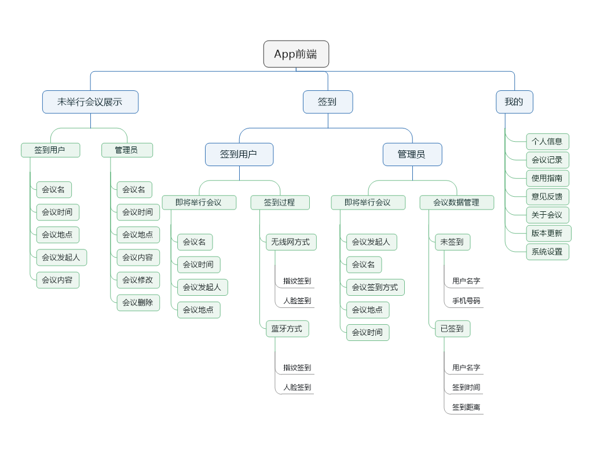

#### 页面展示

- [发布会议](files/发布会议.mp4)
- [指纹签到](files/指纹签到.mp4)
- [指纹签到](files/指纹签到.mp4)

---

---

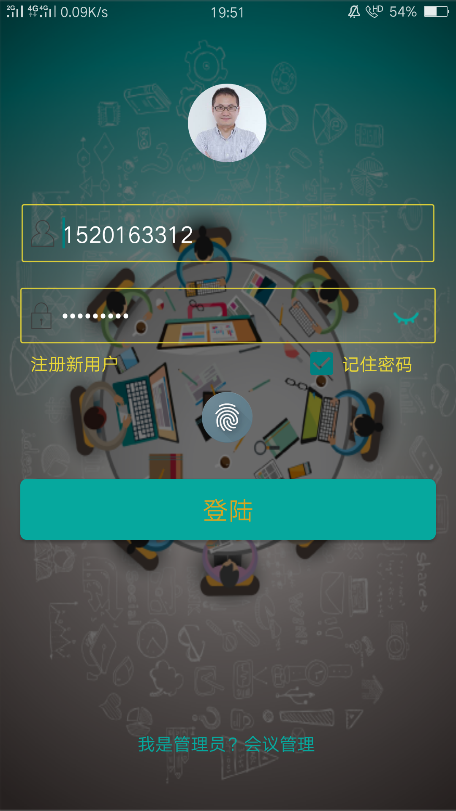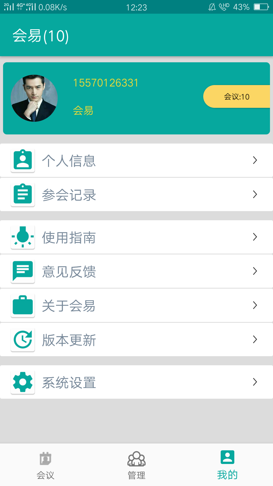

---

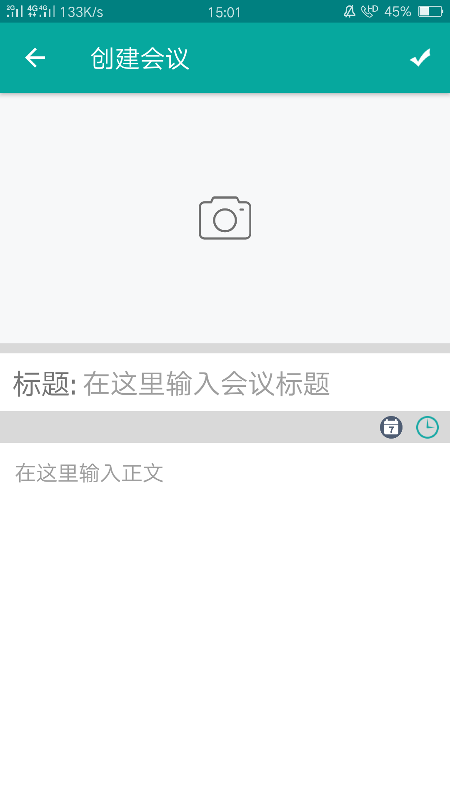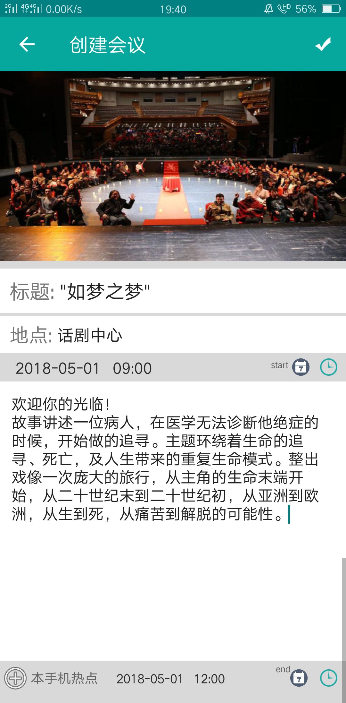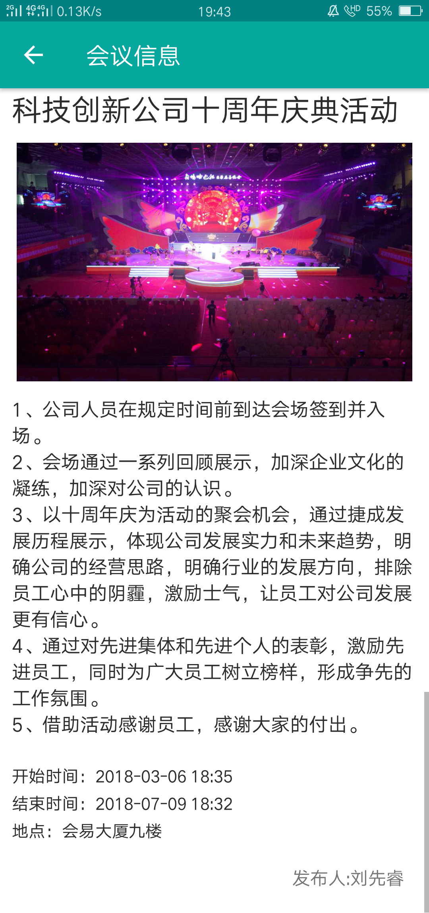

---

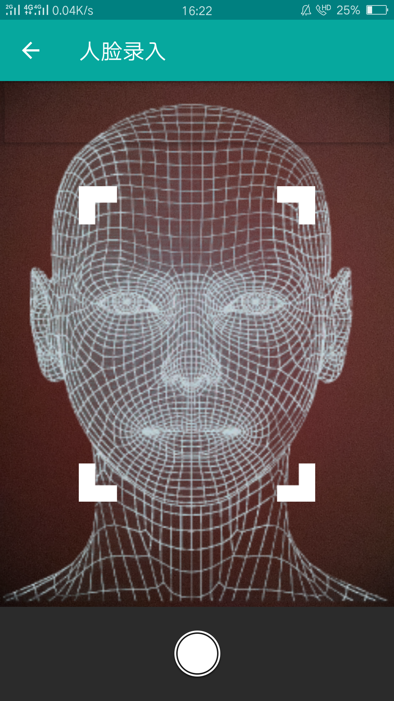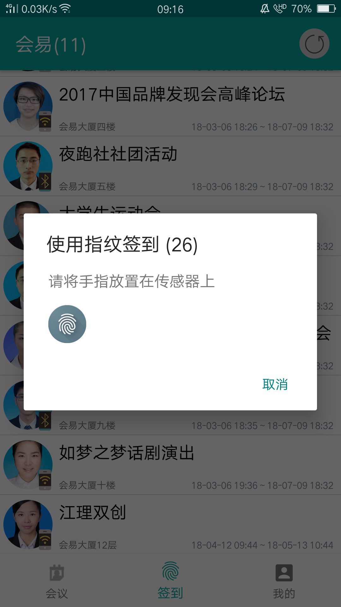

---

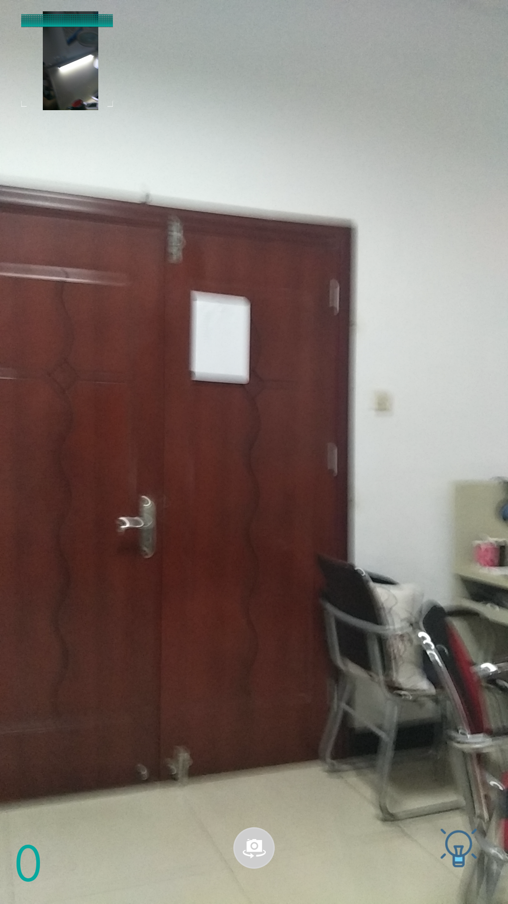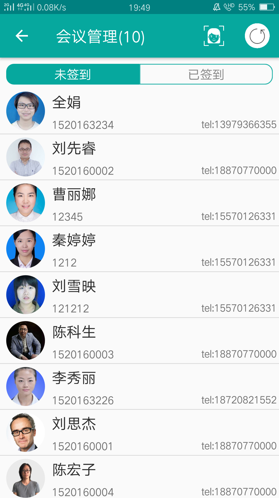

####  第五届发现杯大赛

- 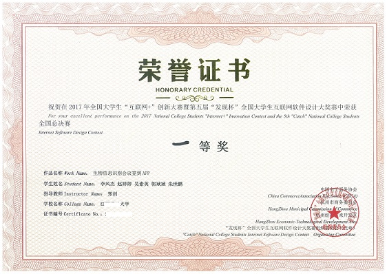
- 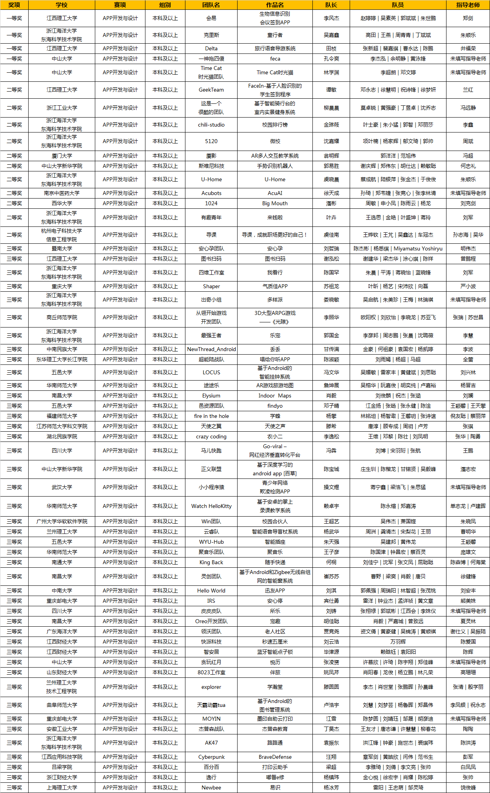
- 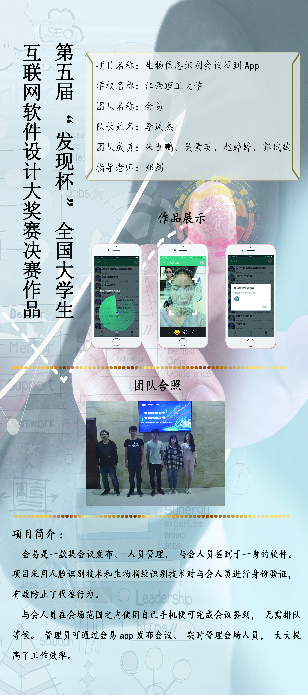

####  新闻报道
-  [发现杯](http://www.dajiangsai.org/static/previousreviews/first-prize.html#app)

